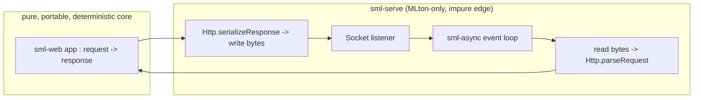

# sml-serve (documented, not built)

> **Status: design document, not a buildable library.**
> This repository deliberately ships no compilable SML and no `make`-able
> target. It documents the one impure edge of the
> [sjqtentacles](https://github.com/sjqtentacles) pure-SML web stack: an
> **MLton-only socket adapter** that drives an
> [`sml-web`](https://github.com/sjqtentacles/sml-web) app against a real TCP
> listener using the [`sml-async`](https://github.com/sjqtentacles/sml-async)
> event loop.

## Why it's kept out of the core

Every library in the stack — from `sml-buffer`/`sml-codec` up through
`sml-http`, `sml-router`, `sml-middleware`, `sml-session`, and the `sml-web`
umbrella — is **pure**: a deterministic `input -> output` over strings and
bytes, with no sockets, threads, clocks, or OS I/O. That is what makes the whole
framework:

- **portable** — it builds identically under MLton and Poly/ML;
- **deterministic** — every behavior is an assertion against a published spec
  vector, so the test suites are byte-identical across compilers;
- **testable without a network** — an entire app is exercised end-to-end over
  hand-built request strings (see `sml-web/examples/app.sml`).

`sml-serve` is where that purity necessarily ends: it opens sockets, reads and
writes bytes, and schedules concurrent connections. Isolating it in its own
adapter — exactly as `sml-async` isolates OS I/O from the portable algorithmic
core — keeps all of the above properties intact for everything else.

## Responsibilities of the adapter

The adapter is intentionally thin. Its whole job is to move bytes between a
socket and a pure `Web.app`:

1. **Listen.** Bind a `Socket.passiveStream` listener on a host/port.
2. **Accept loop.** On the `sml-async` scheduler, accept connections and spawn
   one async task per connection (`Async.start`), so slow clients don't block.
3. **Read a request.** Read bytes until a complete HTTP message is framed —
   headers terminated by `\r\n\r\n`, then the body sized by `Content-Length` or
   `Transfer-Encoding: chunked` (both already decoded purely by
   `Http.decodeBody`).
4. **Dispatch.** Hand the assembled request string to `Web.runString app`,
   which runs the pure router + middleware pipeline and returns a `response`
   (or `NONE` for a malformed message → emit a `400`).
5. **Write a response.** `Http.serializeResponse` the result and write it back;
   honor keep-alive vs. close per the request's `Connection` header and version.
6. **Repeat / close.** Loop for keep-alive, or close the socket.

Everything inside step 4 is pure and already fully tested in the core repos;
steps 1–3, 5–6 are the only code that touches the outside world.

## Reference sketch

A non-compiled reference sketch of the adapter lives at
[`doc/serve.sml.txt`](doc/serve.sml.txt). It is plain text on purpose — there is
no `.mlb`, no `Makefile`, and no CI here, because this edge depends on MLton's
`Socket`/`OS` structures and a running network, neither of which fits the
deterministic test discipline the rest of the stack is built on.

## Building a real adapter (for downstream users)

A concrete `sml-serve` would:

- `require` `sml-web` and `sml-async` and vendor them under `lib/` like every
  other repo;
- expose something like
  `val serve : { host : string, port : int } -> Web.app -> unit async`;
- be MLton-only (its `Makefile` would have no `poly`/`test-poly` targets), and
  its tests would be integration tests against a loopback socket rather than the
  pure `Harness` checks used everywhere else.

That work is left to the deployment layer so the framework proper stays a clean,
portable, reproducible core.

## Future work (consistent with the stack's documented follow-ups)

- TLS termination (or front it with a TLS-terminating proxy).
- HTTP/2 and HTTP/3 (the core's framing is HTTP/1.1).
- A real DEFLATE **encoder** for `Content-Encoding` (`sml-deflate` ships the
  decoder; encoding is documented as future work).
- UTF-8 / surrogate handling at the edges.

## The wider stack

`sml-serve` is the impure edge of a layered set of small, pure, dual-compiler
`sml-*` libraries topped by [`sml-web`](https://github.com/sjqtentacles/sml-web).
Browse the whole project by the
[`sjqtentacles-web`](https://github.com/topics/sjqtentacles-web) topic.

## License

MIT
