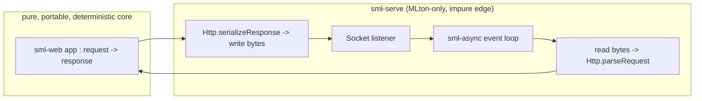

# sml-serve

[](https://github.com/sjqtentacles/sml-serve/actions/workflows/ci.yml)

> **Status: a real, buildable, MLton-only socket adapter.**
> This repository is the one impure edge of the
> [sjqtentacles](https://github.com/sjqtentacles) pure-SML web stack: an
> **MLton-only socket adapter** that drives an
> [`sml-web`](https://github.com/sjqtentacles/sml-web) app against a real TCP
> listener using the [`sml-async`](https://github.com/sjqtentacles/sml-async)
> event loop. It builds with `make`, ships a runnable demo, and is covered by
> a loopback integration test.
>
> It was previously a design document; it is now an actual adapter. The single
> impure module is quarantined exactly as the document described (see
> [Quarantine](#quarantine-mlton-only-impure)).

## Why it's kept out of the core

Every library in the stack — from `sml-buffer`/`sml-codec` up through
`sml-http`, `sml-router`, `sml-middleware`, `sml-session`, and the `sml-web`
umbrella — is **pure**: a deterministic `input -> output` over strings and
bytes, with no sockets, threads, clocks, or OS I/O. That is what makes the whole
framework:

- **portable** — it builds identically under MLton and Poly/ML;
- **deterministic** — every behavior is an assertion against a published spec
  vector, so the test suites are byte-identical across compilers;
- **testable without a network** — an entire app is exercised end-to-end over
  hand-built request strings (see `sml-web/examples/app.sml`).

`sml-serve` is where that purity necessarily ends: it opens sockets, reads and
writes bytes, and schedules concurrent connections. Isolating it in its own
adapter — exactly as `sml-async` isolates OS I/O from the portable algorithmic
core — keeps all of the above properties intact for everything else.



## Responsibilities of the adapter

The adapter is intentionally thin. Its whole job is to move bytes between a
socket and a pure `Web.app`:

1. **Listen.** Bind a passive stream listener on a host/port (`Serve.listenOn`).
2. **Accept loop.** On the `sml-async` scheduler, accept connections and start
   one async task per connection (`Async.start`). The accept step is
   trampolined through `Scheduler.soon`, so it runs in constant stack space.
3. **Read a request.** Read bytes until a complete HTTP/1.1 message is framed —
   headers terminated by `\r\n\r\n`, then the body sized by `Content-Length` or
   `Transfer-Encoding: chunked` (chunked bodies are decoded purely by
   `Http.decodeChunked`). Leftover bytes are kept for the next pipelined message.
4. **Dispatch.** Parse the assembled request and run the pure router +
   middleware pipeline via `Web.run`; a malformed message becomes a `400`.
5. **Write a response.** `Http.serializeResponse` the result and write it back,
   honoring keep-alive vs. close per the request's `Connection` header and
   HTTP version. A `Content-Length` is added when the handler left the body
   unframed, and the chosen `Connection` disposition is advertised.
6. **Repeat / close.** Loop for keep-alive, or close the socket.

Everything inside step 4 is pure and already fully tested in the core repos;
steps 1–3, 5–6 are the only code that touches the outside world. The source is a
single module, [`lib/github.com/sjqtentacles/sml-serve/serve.sml`](lib/github.com/sjqtentacles/sml-serve/serve.sml).

## API

The adapter exposes a `Serve` structure. The headline entry point is:

```sml
(* Bind a listener and serve a pure Web.app forever, accepting on the
   sml-async scheduler and starting one async task per connection. *)
val serve : { host : string, port : int } -> Web.app -> unit
```

Plus the building blocks it is made of, reused by the demo and the tests:

```sml
type sock = (INetSock.inet, Socket.active Socket.stream) Socket.sock

(* Bind a passive listener; returns it with the port actually bound
   (pass port = 0 to ask the OS for an ephemeral port). *)
val listenOn  : { host : string, port : int }
                -> (INetSock.inet, Socket.passive Socket.stream) Socket.sock * int

(* Serve one accepted connection to completion: frame -> Web.run -> write,
   looping while keep-alive holds, then close. *)
val handleConn : Web.app -> sock -> unit Async.async

val sendAll   : sock -> string -> unit
val recvAll   : sock -> string
```

> On the `serve` signature: `sml-async` is a cooperative, single-threaded
> scheduler with **no** OS-I/O integration (its clock is logical, not the wall
> clock). So `serve` returns `unit` and blocks in `accept`; the README's
> sketched `... -> unit async` shape would imply a runtime that interleaves
> socket readiness, which this scheduler does not provide. We honor the async
> structure (`handleConn` is a `unit Async.async`, started per connection via
> `Async.start`, accept driven by `Scheduler`), while being honest that
> connections are handled sequentially. See [Quarantine](#quarantine-mlton-only-impure).

## Demo

```sh
make example          # self-contained loopback demo (binds an ephemeral port,
                      # issues one real request to itself, prints it, exits)

make serve            # build only; then run a real server:
bin/serve-mlton serve 8080
# ... and from another shell:  curl -i http://127.0.0.1:8080/greet/alice
```

`make example` is deterministic and prints:

```
=== sml-serve loopback demo ===
request:  GET /greet/alice HTTP/1.1
response over a real 127.0.0.1 socket:
HTTP/1.1 200 OK
Content-Type: text/html
X-Powered-By: sml-serve
Content-Length: 82
Connection: close

<html><head><title>Greeting</title></head><body><p>Hello, alice!</p></body></html>
access log: GET /greet/alice -> 200
```

## Build & test

```sh
make           # build the demo + integration-test binaries (MLton)
make smoke     # build + run the loopback integration test (MLton)
make test-poly # build + run the pure vendored-sml-json suite under Poly/ML
make all-tests # smoke + the pure suite on both compilers, byte-identical
make clean
```

The socket adapter and its loopback **integration** suite are MLton-only (see
below). The one exception is the small **pure** vendored-`sml-json` integer
boundary suite in `test/pure/`: it does no I/O, so it builds and runs under
both MLton and Poly/ML (the latter via `tools/polybuild`) and its output is
byte-identical across the two — `make all-tests` asserts exactly that.

## Quarantine (MLton-only, impure)

This repo is deliberately **outside** the dual-compiler, byte-identical purity
guarantee that the rest of the stack provides:

- **MLton-only adapter.** `serve.sml` uses the Basis `Socket`/`INetSock`/
  `NetHostDB` structures and a live network; the adapter itself and its
  integration binary are built only by MLton. (The `tools/polybuild` wrapper and
  the `test-poly` target exist solely for the *pure* boundary suite described
  below, which never touches `serve.sml`.)
- **Impure.** It opens sockets, reads/writes bytes, and schedules connections.
  Its integration tests are **integration tests against a loopback socket**
  (bind on `127.0.0.1`, issue a request, assert the response) rather than the
  pure `Harness` spec-vector checks used everywhere else. They require the local
  loopback network, but no external hosts. The separate `test/pure/` suite *is*
  a pure `Harness` spec-vector suite and does run on both compilers.
- **Sequential, not concurrent.** Because `sml-async` is single-threaded with
  no OS-I/O readiness, connections are accepted and handled one at a time. A
  production adapter would need real non-blocking I/O / threads for that.

Everything `sml-serve` *dispatches to* (`Web.run`, `Http.*`) stays pure and
fully covered by the core repos' deterministic suites.

## Dependencies

`sml-web` (the umbrella, which itself vendors the tier-0/1/2 libraries) and
`sml-async` are vendored byte-for-byte under
`lib/github.com/sjqtentacles/`, committed, so `make` needs no network.

```
package github.com/sjqtentacles/sml-serve
require {
  github.com/sjqtentacles/sml-web
  github.com/sjqtentacles/sml-async
}
```

## Layout

```
lib/github.com/sjqtentacles/
  sml-serve/
    serve.sml            the adapter (the only impure module)
    sources.mlb          basis + sml-web + sml-async + serve.sml
    sml-serve.mlb        public library basis (MLton/MLKit)
  sml-web/ sml-async/ ...  vendored dependencies (byte-for-byte)
examples/
  main.sml  serve.mlb    runnable demo (loopback round-trip + real server)
test/
  integration.sml        loopback integration suite (15 checks, MLton-only)
  json_boundary.sml      pure vendored-sml-json integer boundary suite (7 checks)
  harness.sml entry.sml main.sml sources.mlb
  pure/                  pure suite as a standalone dual-compiler binary
    entry.sml main.sml sources.mlb
tools/polybuild          Poly/ML .mlb driver (for the pure suite only)
doc/serve.sml.txt        the original reference sketch (kept for history)
Makefile
```

## A note on JSON integer precision

The vendored `sml-json` carries JSON integers as `JInt of IntInf.int`
(arbitrary precision), not a machine `int`. A large integer field — a
millisecond epoch timestamp such as `1700000000000`, a 64-bit id — therefore
parses and serializes **losslessly and identically** under MLton (whose default
`int` is a fixed-width 32-bit word) and Poly/ML (fixed-width 63-bit); a naive
machine-`int` payload would raise `Overflow` under MLton past ~2³¹. The
`test/pure/` suite pins this behaviour and, being pure, proves it byte-for-byte
on both compilers.

## Reference sketch

The original non-compiled reference sketch is preserved at
[`doc/serve.sml.txt`](doc/serve.sml.txt). The shipped `serve.sml` follows it
closely, with real message framing (proper body sizing + pipelining), a
trampolined accept loop, response framing/`Connection` normalization, and the
corrected `sml-async` API (`Async.start`/`Scheduler` rather than the sketch's
imagined `Scheduler.current`).

## Future work (consistent with the stack's documented follow-ups)

- TLS termination (or front it with a TLS-terminating proxy).
- HTTP/2 and HTTP/3 (the core's framing is HTTP/1.1).
- A real DEFLATE **encoder** for `Content-Encoding` (`sml-deflate` ships the
  decoder; encoding is documented as future work).
- True concurrency (non-blocking I/O / threads), timeouts, connection limits,
  backpressure, request-size caps (compose `Middleware.limitBody`), and
  graceful shutdown.
- UTF-8 / surrogate handling at the edges.

## The wider stack

`sml-serve` is the impure edge of a layered set of small, pure, dual-compiler
`sml-*` libraries topped by [`sml-web`](https://github.com/sjqtentacles/sml-web).
Browse the whole project by the
[`sjqtentacles-web`](https://github.com/topics/sjqtentacles-web) topic.

## License

MIT
